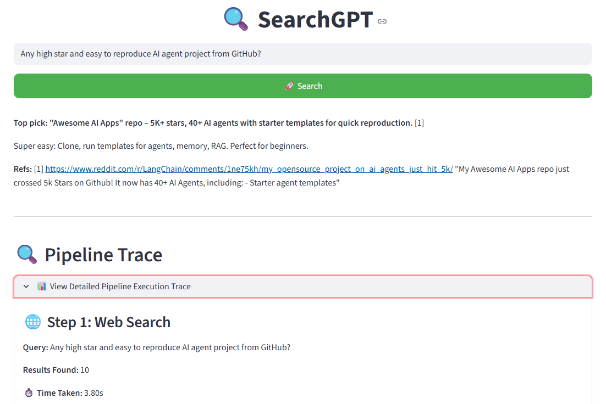

# SearchGPT - AI-Powered Search Engine

An intelligent search engine that combines real-time web search with AI-powered answer generation using OpenRouter API.

**Built on the excellent work of [Wilson-ZheLin/SearchGPT](https://github.com/Wilson-ZheLin/SearchGPT)**

## ✨ Features

- 🔍 **Real-time Web Search** via Serper (Google API)
- 🤖 **AI-Powered Answers** using OpenRouter (multiple free models available)
- 🌐 **Beautiful Streamlit Interface** with Lottie animations
- 📚 **Semantic Search** with ChromaDB vector database
- 🎯 **Smart Document Retrieval** using text-embedding-3-small or Gitee BGE-M3
- 🔗 **Source Citations** with clickable references
- 🌍 **Multi-language Support** (auto-detects Chinese/English)
- ⚡ **Multi-threaded Web Scraping** for fast content extraction
- 💾 **Export Results** as TXT or JSON
- 🎨 **No LangChain Required** - lightweight and fast
- 📊 **Complete Pipeline Tracing** - see every step with timing, API calls, and similarity scores
- 🔎 **Full Prompt Visibility** - inspect exactly what's sent to the LLM
- ⏱️ **Performance Metrics** - track time spent on each pipeline step

## 🚀 Quick Start

### Prerequisites

- Python 3.11+ recommended
- [OpenRouter API Key](https://openrouter.ai/) (free tier available)
- [Serper API Key](https://serper.dev/) (2,500 free queries)

### Installation

1. **Clone the repository**
```bash
git clone <your-repo-url>
cd SearchGPT
```

2. **Install dependencies**
```bash
pip install -r requirements.txt
```

3. **Configure API Keys**

You can either:
- Enter them in the Streamlit UI when running the app, OR
- Save them in `src/config/config.yaml`:

```yaml
model_name: x-ai/grok-4.1-fast:free
openrouter_api_key: "your-openrouter-key-here"
serper_api_key: "your-serper-key-here"
```

### Running the Application

**Streamlit Web Interface (Recommended):**
```bash
streamlit run app.py
```

**Command Line:**
```bash
python src/main.py
```

## 🎯 Available Models

### Free Models (via OpenRouter)
- **x-ai/grok-4.1-fast:free** - GPT-4 equivalent (recommended)
- **openai/gpt-oss-20b:free** - GPT-3.5 equivalent

### Premium Models (require credits)
- openai/gpt-3.5-turbo
- openai/gpt-4
- anthropic/claude-3-haiku
- anthropic/claude-3-sonnet

## 📁 Project Structure

```
SearchGPT/
├── app.py                      # Streamlit web interface
├── src/
│   ├── main.py                # CLI entry point
│   ├── fetch_web_content.py   # Web scraping with multi-threading
│   ├── serper_service.py      # Serper API integration
│   ├── retrieval.py           # Vector database & embeddings
│   ├── llm_answer.py          # AI answer generation
│   ├── llm_service.py         # OpenRouter API service
│   ├── text_utils.py          # Text processing utilities
│   └── config/
│       └── config.yaml        # Configuration file
├── requirements.txt           # Python dependencies
└── README.md                  # This file
```

## 🔧 Configuration

The `src/config/config.yaml` file supports:

- **model_name**: AI model to use
- **openrouter_api_key**: Your OpenRouter API key
- **serper_api_key**: Your Serper API key
- **template**: Custom prompt template for AI responses

## 📸 Screenshots

### Main Interface


### Pipeline Trace - Search & Scraping


### Pipeline Trace - Embeddings & Retrieval


### Pipeline Trace - Chunks & Similarity Scores


### Pipeline Trace - Full Prompt & Generation


## 📖 Usage Examples

### Via Streamlit UI

1. Launch the app: `streamlit run app.py`
2. Enter your API keys in the sidebar (or use saved keys)
3. Select your preferred AI model
4. Choose an AI profile (Researcher, Technical Expert, etc.)
5. Enter your search query
6. Click "🚀 Search"

### Via Command Line

Edit the query in `src/main.py` and run:
```bash
python src/main.py
```

## 🛠️ Key Technologies

- **OpenRouter API** - Access to multiple AI models
- **Serper API** - Fast Google search results
- **ChromaDB** - Vector database for semantic search
- **Streamlit** - Modern web interface
- **BeautifulSoup4** - Web scraping
- **text-embedding-3-small** - Efficient text embeddings

## 🔍 How It Works

1. **Search**: Query sent to Serper API for real-time web results
2. **Scrape**: Multi-threaded extraction of content from top results
3. **Embed**: Text chunked and converted to vector embeddings (OpenRouter or Gitee AI)
4. **Retrieve**: Semantic search finds most relevant content with similarity scores
5. **Generate**: AI model creates comprehensive answer with citations

### Pipeline Tracing

SearchGPT provides complete visibility into every step of the RAG pipeline:

- **Step 1 - Search**: See all URLs, titles, and snippets returned by Serper
- **Step 2 - Scraping**: Track success/failure for each page with content previews
- **Step 3 - Embeddings**: View API calls made, timing, and chunks processed
- **Step 4 - Retrieval**: Inspect similarity scores for each retrieved chunk (color-coded by relevance)
- **Step 5 - Generation**: See the exact prompt sent to the LLM and all context chunks

All steps include timing information to help identify bottlenecks and optimize performance.

## 📝 Logging

Comprehensive logging is built-in. Check your terminal for detailed logs:
- Serper API requests and responses
- Web scraping progress (per thread)
- Embedding generation status
- AI model responses
- Error diagnostics

## 🤝 Contributing

Contributions are welcome! Feel free to:
- Report bugs
- Suggest features
- Submit pull requests

## 📄 License

This project is licensed under the MIT License.

## 🙏 Acknowledgments

This project is built on the foundation of [Wilson-ZheLin/SearchGPT](https://github.com/Wilson-ZheLin/SearchGPT). Significant enhancements include:
- Migration from OpenAI to OpenRouter API
- Removal of LangChain dependencies
- Addition of Streamlit web interface
- Modern ChromaDB integration
- Comprehensive logging system
- Updated embedding models

## ⭐ Star This Repo

If you find this project useful, please give it a star! ⭐
